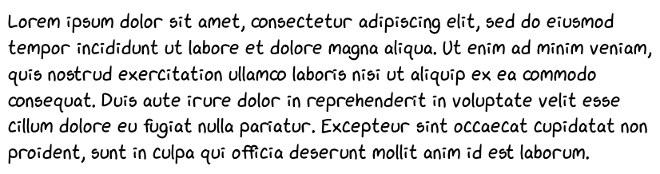

# xkcd-font

Fonts derived from the handwriting of @randallmunroe, the [xkcd](https://xkcd.com) webcomic author.
Yes, it really is his handwriting, and he hopes we [fix the pesky kerning](http://xkcd.com/1015/):

[Credit to xkcd]

This repository contains two fonts, ``xkcd Script`` and ``xkcd``, each with their own characteristics (and limitations):

### Font: ``xkcd Script``

``xkcd Script`` is a font derrived from a [handwriting sample](xkcd-script/generator/handwriting_minimal.png) provided by Randall.
It is far less uniform than ``xkcd``, and we think it is therefore more like a true script font.

[Read more...](xkcd-script/README.md)

### Font: ``xkcd``

The ``xkcd`` font was originally created by Randall, and was used in [xkcd "The Pace of Modern Life" (April 1st, 2013)](https://xkcd.com/1227/).
It is considerably more uniform than ``xkcd Script``, which can result in more legibility at the cost being slightly less like the actual xkcd comic.

[Read more...](xkcd/README.md)

## License

This work is licensed under a [Creative Commons Attribution-NonCommercial 3.0 License](LICENSE).

## Contributing

Contribution [guidelines](.github/CONTRIBUTING) exist to simplify the review process and ensure constency in the repository.
In addition, font specific contribution guidelines can be found in the README of each font ([xkcd-script](xkcd-script/README.md), [xkcd](xkcd/README.md)).
